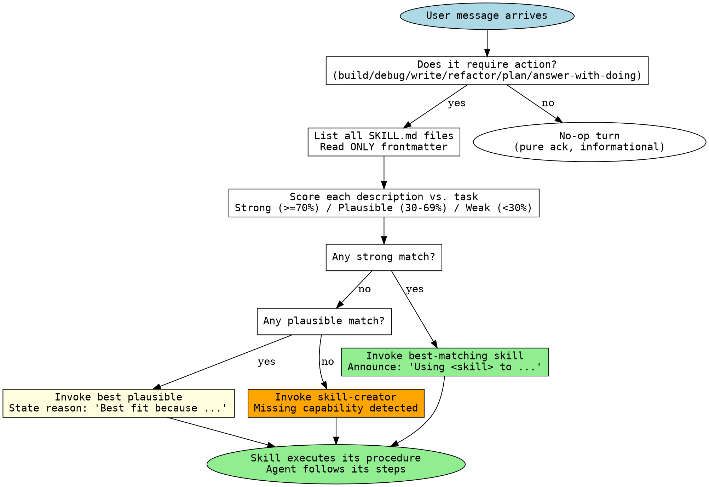

# Discovery Flowchart

The visual form of the protocol. Use this when ambiguity appears.

## Dot-language diagram



Render with `dot -Tsvg` if needed; the structure stands as plain text.

## ASCII fallback

```
User message arrives
      |
      v
Does it require action?
      |
   yes|     no
      |      \_____ no-op turn (pure ack)
      v
List SKILL.md files (frontmatter only)
      |
      v
Score each description vs. task
      |
      v
Any strong (>=70%) match?
      |
   yes|     no
      |      \_____ Any plausible (30-69%) match?
      |                |
      |             yes|       no
      |                |         \____ Invoke skill-creator
      |                |                       |
      |                v                       v
      |        Invoke best plausible      Capture missing capability
      |        ("Best fit because ...")        |
      v                |                       |
Invoke best skill      |                       |
("Using <skill> to ...")|                      |
      |                |                       |
      +-------+--------+----------+------------+
              |
              v
Skill executes its procedure
```

## Edge cases

### Multiple strong matches

Pick the most specific. Specificity beats breadth. A skill named `vitest-unit-tests` beats `testing-discipline` for a Vitest task.

If two skills are equally specific, the one whose description contains the user's literal keywords wins. The user said "Zod" → prefer the skill whose description includes "Zod" over one that says "validation".

### Match is partial — only the trigger overlaps, not the deliverable

This is a YELLOW flag. The skill is being pulled in by trigger keywords but produces something the user did not ask for. Two options:

1. Invoke the skill anyway and adapt the output. Acceptable when the deliverable is close.
2. Invoke `skill-creator` to add a sibling skill with the same trigger but a different deliverable.

Choose option 2 if you find yourself doing option 1 the third time.

### Match is partial — deliverable matches but trigger does not

This is a NORMAL case. The user's phrasing was different from the skill's trigger list. Invoke the skill, update its description in the next maintenance pass to add the missing trigger phrasing.

### No SKILL.md files found at all

The framework is not initialised in this directory. Run `/connx init` (or the framework's equivalent scaffold command) and re-run discovery.

## Audit trail

The announcement line ("Using <skill> to ...") is the audit record. If you re-read a session log, every action should be preceded by a discovery announcement. Missing announcements are protocol violations and indicate the agent freelanced.
